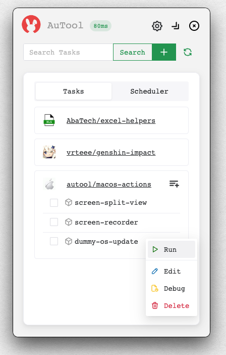
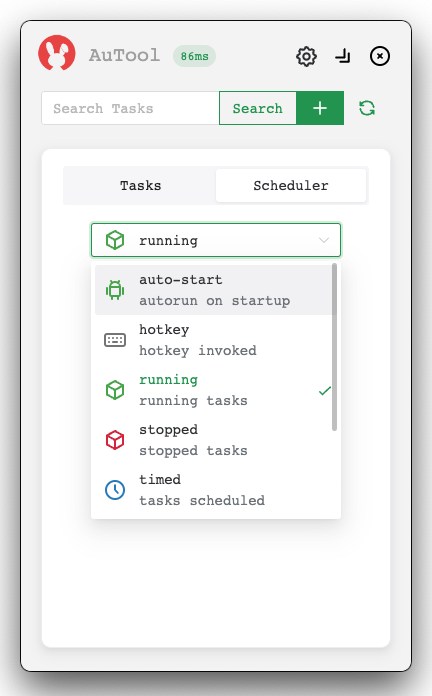

<p align="center">
  
</p>

## What is AuTool?
- 类似IFTTT的 效率工具, 用来 streamline / automate 繁琐的UI操作

## What can you do with it?
- MacOS/Windows: 监听聊天群消息; [自动切换输入法](https://inputsource.pro/zh-CN); [快速调整窗口layout](https://apps.apple.com/app/id441258766); [录制视频转GIF]()
  
- Web: [爬取RSS信息，推送到手机](https://huginn.cn/blog/huginn/huginn-%e8%87%aa%e5%ae%9a%e4%b9%89%e6%8a%93%e5%8f%96%e6%8e%a8%e9%80%81smzdm%e5%92%8cv2ex%e7%9a%84%e4%bc%98%e6%83%a0%e4%bf%a1%e6%81%af); [抢票，抢打折单品](https://whop.com/charts/top_rentals/); [录制/重复网页操作](https://www.tango.us/pricing), [自动解决CAPTCHA]()

- iOS/Android: [接受消息推送](https://github.com/Finb/Bark); 调度云端任务; 手机接受OTP验证码, 推送到云端完成验证

## Why?
- 流程自动化需要大量customization，然而现有的产品追求low-code，缺少fine-grained programmable control，很难实现复杂需求

- 现有产品很贵；同质化严重；编程不友好，开放成本很高；不支持云部署；不支持多平台；不支持多用户协作；占用系统资源多；追求插件大而全，重复造轮子，而且还造不好；缺少killer app，大量伪需求

## Why AuTool？
- 开源免费；跨平台；API可读性更好，方便配置
- 事件驱动编程；async 执行引擎，节省系统资源；轻量级，高并发
- 多设备协同，支持手机端/PC/Mac；跨用户推送消息，执行任务
- 鼓励插件独立化，服务化，docker化；方便原始代码复用，避免重复造轮子

## How it looks like?
- Compose automation script in YAML

```yaml
task: auto-switch-keyboard-input

configs:
  options: ['autostart']
  hotkey: Ctrl+L

actions:
  ## 在窗口切换时触发 hook 事件
  - event.on(__ACTIVE_WINDOW_CHANGED) => $win:
    - cmd.if({{ $win in ['WeChat'] }}):
      - os.run(InputSourceSelector select com.apple.inputmethod.SCIM.ITABC)
  
  # 推送消息到手机
  - user.notify({{ {'to':$env[PHONE],'title':'...'} }})
```

- Execute the script inside the app

<p align="center">
  
</p>

- Schedule the script inside the app
<p align="center">
  
</p>


## Competitors
- Low-code: Microsoft Power Automate, UiPath, UiBot
- Web Automator: uTools, Zapier, n8n, IFTTT，HugInn
- App launcher: Alfred, LaunchBar, Quicksilver, Spotlight, Raycast
- DSL: AppleScript, TagUI, VBA, Anjian, AutoHotKey, Keyboard Maestro, Hammerspoon
- Mobile: Android Tasker, iOS shortcut