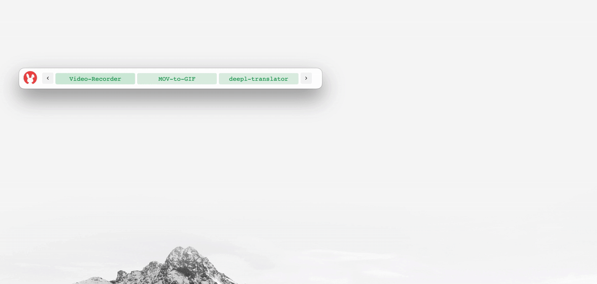
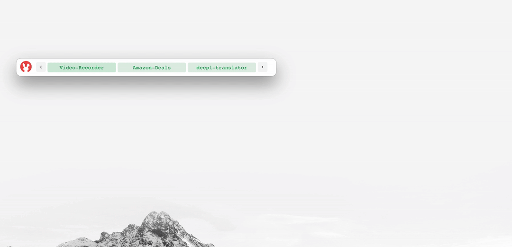
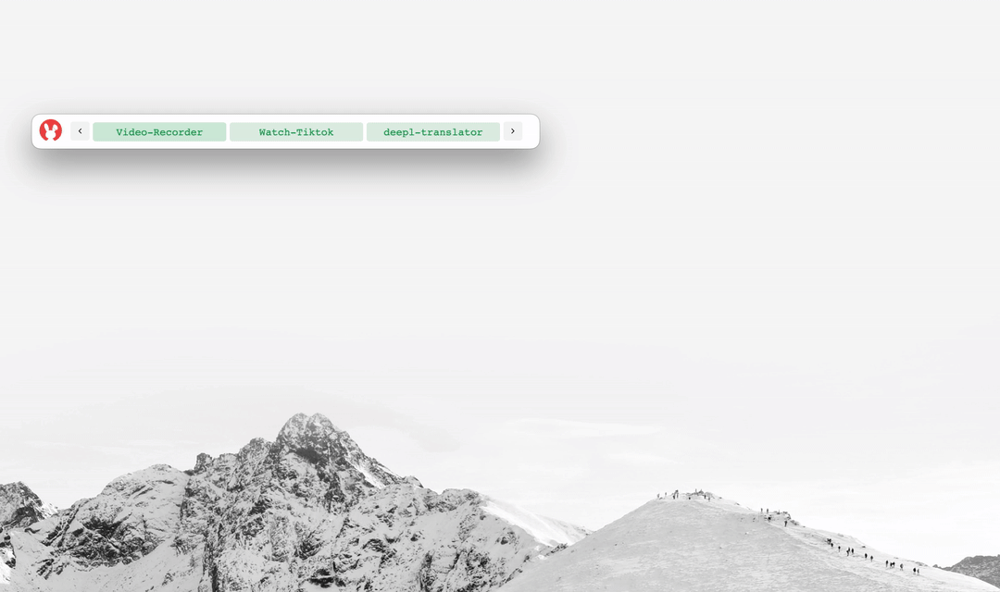

<p align="center">
  
</p>

[Documents](https://danalite.github.io/autool/) | [APIs](https://danalite.github.io/autool/) | [简体中文](docs/README-zh.md)

[](https://github.com/danalite/autool/actions)
[](https://github.com/danalite/autool/releases)
[](https://discord.gg/P3t2SvQaZp)

AuTool is a scripting language that brings the power of Greasy Monkey to your desktop environment. It provides a rich set of APIs to help you interact with operating system and network, which can be used to automate your workflow with ease. 

## Install AuTool
- Download and install AuTool app from the following links:

[](https://github.com/danalite/autool/releases)
[](https://github.com/danalite/autool/releases)
[](https://github.com/danalite/autool/releases)

- After installing the AuTool, download scripts from [our website](https://danalite.github.io/autool/) to import the features. The downloaded scripts are shown in AuTool task manager, which is ready to run by click.

<p align="center">
  
</p>

## Example AuTool Scripts
[](https://danalite.github.io/autool/docs/basics/apps-macos-runner)

We provide *Mini-Tools*, an AuTool script bundle as an example to get you started. It can be downloaded by clicking the icon above. *Mini-Tools* includes the following scripts:

- [x] [File Search](https://github.com/danalite/autool-script-examples/blob/master/danalite/Mini-Tools/File-Searcher.yaml): Click the *File-Searcher* button and enter keywords to search in the popup window. 


- [x] [Password Manager](https://github.com/danalite/autool-script-examples/tree/master/danalite/Mini-Tools/Password-Manager): this script allows you to generate passwords, copy existing passwords to clipboard, or import passwords; developed based on [*`pass`*](https://www.passwordstore.org/).


- [x] [Format Converter](https://github.com/danalite/autool-script-examples/tree/master/danalite/Mini-Tools/Clipboard-Manager): select MOVs and convert into GIFs; developed based on [*`ffmpeg`*](https://ffmpeg.org/).



- [x] [Amazon Deals](https://github.com/danalite/autool-script-examples/tree/master/danalite/Mini-Tools/): Gather hot deals from cloud monitor and keep you informed. 



- [x] [Daily Vocabulary](https://github.com/danalite/autool-script-examples/tree/master/danalite/Mini-Tools/Clipboard-Manager): show vocabulary flashcards with example sentence and audio; developed on [*`AnkiConnect`*](https://foosoft.net/projects/anki-connect/) and OpenAI GPT APIs. 


- [x] [Watch Tiktok](https://github.com/danalite/autool-script-examples/tree/master/danalite/Mini-Tools/): scrapes Tiktok videos from internet and displays them in a popup window. 



## Write Your Own Scripts
- Each AuTool script is a YAML text file which contains a sequence of actions. As followed is a simple AuTool script to run a shell command when the clipboard changes:

```yaml
task: clipboard-monitor
configs:
  - hotkey: ~
  - autostart: true

actions:
  - event.on(__OS_CLIPBOARD_CHANGED__) => $e:
      - cmd.if( {{ $e.type == "image" }} ):
          - os.shell(xclip -selection clipboard -t image/png -o > /tmp/clipboard.png)
```

## Contributing
Contributions are welcome! To contribute, please fork this repository, create a branch for your changes, and submit a pull request. Before submitting a pull request, please make sure that your changes are fully tested and that they adhere to the contributing guidelines.

## License
**FOR PERSONAL USAGE ONLY**. AuTool is released under [GPL v3.0 license](LICENSE). For any commercial use, please contact support@autool.site. The intellectual property of this product is protected by patents, and any unauthorized use will be subject to legal liability. All the rights are reserved by DanaLite Tech LTD (SG).