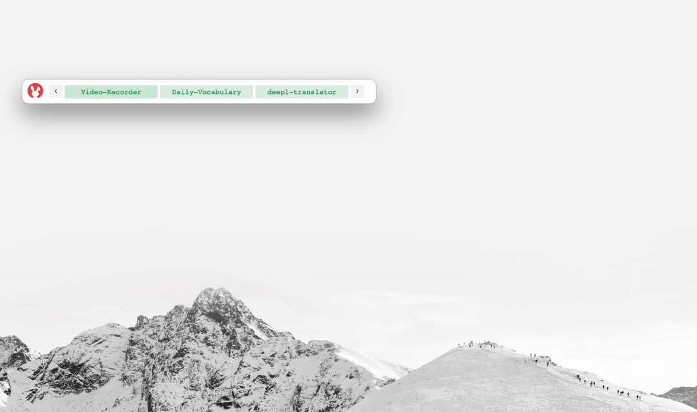

<p align="center">
  
</p>

[Documents](https://danalite.github.io/autool/) | [APIs](https://danalite.github.io/autool/) | [简体中文](docs/README-zh.md)

[](https://github.com/danalite/autool/releases/latest)
[](https://github.com/danalite/autool/actions)
[](https://github.com/danalite/autool/releases)
<a href="https://discord.gg/P3t2SvQaZp"></a>

AuTool is a scripting/glue language for workflow automation and digital adoption. AuTool was initially developed as an enhancement to [AutoHotkey](https://www.autohotkey.com/), with the purpose of supporting event-driven async programming, improving user interactivity, and ensuring platform agnosticism. It can be used to:

- Automate repetitive tasks, e.g., keyboard, mouse, and web
- Build interactive GUI to guide users through a workflow
- Combine software components to create your custom workflow

We aim to make AuTool a desktop version of Tampermonkey, featuring lightweight and personalized scripts that can be easily installed to cater to your own requirements.

## Install AuTool
- Download and install AuTool app from the following links:

[](https://github.com/danalite/autool/releases)
[](https://github.com/danalite/autool/releases)
[](https://github.com/danalite/autool/releases)

- Once you have installed AuTool, you can download your desired scripts from [our website](https://danalite.github.io/autool/). These scripts will then appear in the AuTool task manager, where they can be executed with a single click.

<p align="center">
  
</p>

### Usage
<details>
<summary>
#### Install new scripts
</summary>
- Click the `+` icon and enter a GitHub folder link that contains a `autool-tasks.json`, such as https://github.com/danalite/autool-script-examples/tree/master/danalite/MacOS-Display.
</details>

<details>
<summary>
#### Minimize AuTool into a taskbar
</summary>
- Minimize the window into a taskbar by clicking on the rabbit icon at the top. The taskbar will display all checked scripts, and you can run any script by clicking on it.
</details> 

<details>
<summary>
#### Interact with the script with dialog
</summary>
- A dialog resembles a system notification in the form of a pop-up window. The dialog's content can be customized by using JSON in the script. Check out [this example](https://github.com/danalite/autool-script-examples/blob/master/danalite/Mini-Tools/Password-Manager/Password-Manager.yaml):

<p align="center">
  
</p>
</details> 

<details>
<summary>
#### Annotate screen with floating tips
</summary>
- Annotations are floating windows that can be used to display information and tips. It is highly customizable and can be used to trigger diverse actions. Check out [this example]()
</details> 


## Example AuTool Scripts
[](https://danalite.github.io/autool/docs/basics/apps-macos-runner)

Here is a few AuTool example scripts to get you started and get a taste on what AuTool can help you with. The scripts can be downloaded by clicking the icon above.

- [Quick search and open files](https://github.com/danalite/autool-script-examples/blob/master/danalite/Mini-Tools/File-Searcher.yaml): enter keywords to search and open files or folders.
- [Password Manager](https://github.com/danalite/autool-script-examples/tree/master/danalite/Mini-Tools/Password-Manager): generate a new password or copy existing passwords to clipboard.
- [Format Converter](https://github.com/danalite/autool-script-examples/tree/master/danalite/Mini-Tools/Clipboard-Manager): convert MOVs into GIFs or other formats.
- [Amazon Deals](https://github.com/danalite/autool-script-examples/tree/master/danalite/Mini-Tools/): gather hot deals from cloud monitor and keep you informed. 
- [Vocabulary flashcards](https://github.com/danalite/autool-script-examples/tree/master/danalite/Mini-Tools/Clipboard-Manager): flashcards with example and audio. 

## Write Your Own Scripts
- Each AuTool script is a YAML text file which contains a sequence of actions. Here is a simple AuTool script example to push a notification to you when your copied content contains a keyword:

```yaml
task: clipboard-monitor  # task name
configs:
  - hotkey: ~  # no hotkey bind to this task
  - autostart: true  # the task is started on startup

actions:
  # event is triggered if clipboard content is updated
  - event.on(__CLIPBOARD_CHANGED__) => $e:
      - cmd.if( {{ 'keyword' in $e.content }} ): 
          - user.notify({{ {'title':'keyword detected' }}) 
```

## Contributing
Contributions are welcome! To contribute, please fork this repository, create a branch for your changes, and submit a pull request. Before submitting a pull request, please make sure that your changes are fully tested and that they adhere to the contributing guidelines.

## License
**FOR PERSONAL USAGE ONLY**. AuTool is licensed under [GPL v3.0 license](LICENSE). Please contact support@autool.site for any commercial use. The intellectual property of this product is protected by patents, and any unauthorized use will be subject to legal liability. All the rights are reserved by DanaLite Tech LTD (SG).

## Acknowledgement
We learned a lot from the following projects when building AuTool:
- [Task](https://taskfile.dev/): task runner and build tool programmed with YAML
- [Zapier](https://zapier.com): workflow automation that glues software components together
- [AutoHotkey](https://www.autohotkey.com/): a DSL that automates repetitive processes on Windows
- [GNOME Zenity](https://github.com/GNOME/zenity): a tool to create GUI for CLI apps on Linux