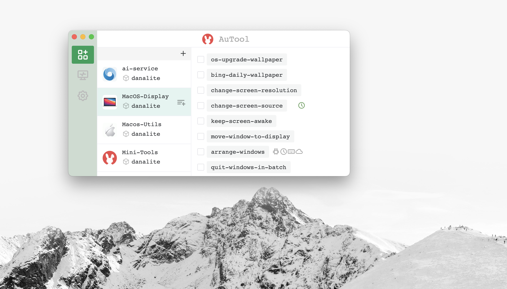
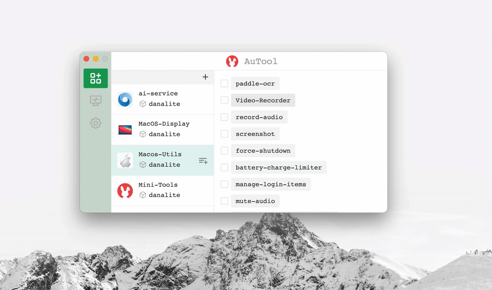
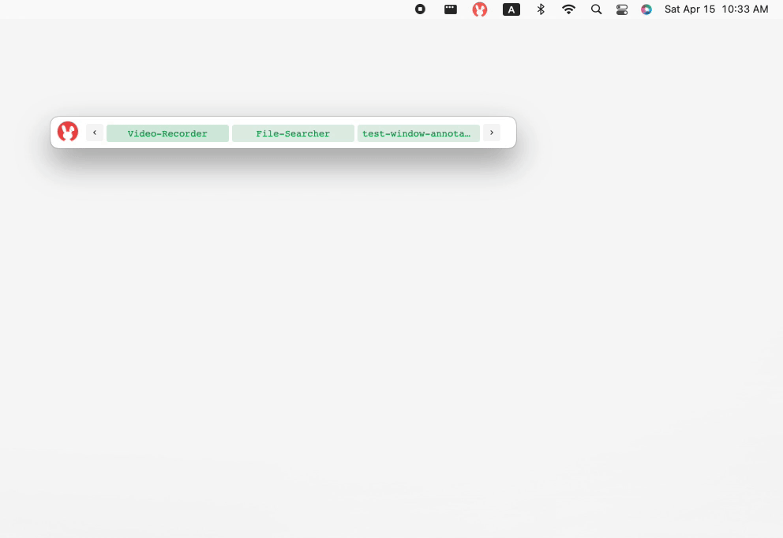
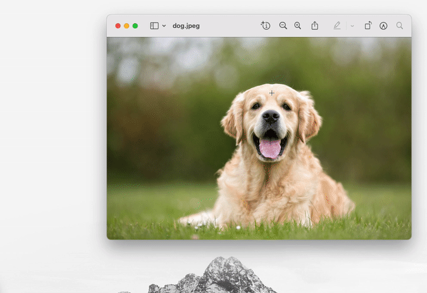

<p align="center">
  
</p>

[文档](https://danalite.github.io/autool/) | [APIs](https://danalite.github.io/autool/) 

[](https://github.com/danalite/autool/releases/latest)
[](https://github.com/danalite/autool/actions)
[](https://github.com/danalite/autool/releases)
<a href="https://discord.gg/P3t2SvQaZp"></a>


AuTool是一种用于工作流自动化的软件平台。AuTool最初的愿景是作为[AutoHotkey](https://www.autohotkey.com/)的增强版本，旨在支持事件驱动的异步编程、改善用户交互性，以及跨平台使用。它可以用于：

- 自动化重复任务，例如键盘、鼠标和网络操作
- 构建交互式 GUI，引导用户使用软件
- 结合多种软件组件，创建自定义工作流

我们的目标是使 AuTool 成为桌面版的 Tampermonkey，具有轻量级和个性化脚本，可以轻松安装以满足您的需求。

## 安装 AuTool
- 从以下链接下载并安装 AuTool 应用程序：

[](https://github.com/danalite/autool/releases)
[](https://github.com/danalite/autool/releases)
[](https://github.com/danalite/autool/releases)

- 安装了 AuTool 后，您可以从[我们的网站](https://danalite.github.io/autool/)下载所需的脚本。这些脚本将出现在 AuTool 任务管理器中，可以通过单击执行。
<p align="center">
  
</p>

## 使用
### 管理脚本
- *安装新脚本*：点击`+`图标并输入包含 `autool-tasks.json` 的GitHub文件夹链接，例如 https://github.com/danalite/autool-script-examples/tree/master/danalite/MacOS-Display。

- *将窗口最小化到任务栏*：点击顶部的兔子图标。任务栏将显示所有选中的脚本，您可以通过单击来运行任何脚本。

Install new scripts            |  Taskbar
:-------------------------:|:-------------------------:
 |  

### 与脚本交互
- *弹出对话框*：AuTool脚本可以通过显示弹出对话框来要求用户输入。该对话框可用于收集用户输入或向用户显示信息。

- *屏幕注释*：AuTool脚本可以在窗口上绘制注释，以指导用户使用软件。注释不会干扰用户与软件的交互。

弹出对话框             |  屏幕注释
:-------------------------:|:-------------------------:
 | 

## AuTool示例脚本
[](https://danalite.github.io/autool/docs/basics/apps-macos-runner)

以下是一些AuTool示例脚本，可帮助您入门并了解AuTool可以帮助您做什么。可以通过单击上面的图标下载这些脚本。

- [快速搜索和打开文件](https://github.com/danalite/autool-script-examples/blob/master/danalite/Mini-Tools/File-Searcher.yaml)：输入关键字以搜索和打开文件或文件夹。
- [密码管理器](https://github.com/danalite/autool-script-examples/tree/master/danalite/Mini-Tools/Password-Manager)：生成新密码或将现有密码复制到剪贴板。
- [格式转换器](https://github.com/danalite/autool-script-examples/tree/master/danalite/Mini-Tools/Clipboard-Manager)：将MOV转换为GIF或其他格式。
- [亚马逊促销](https://github.com/danalite/autool-script-examples/tree/master/danalite/Mini-Tools/)：从云监视器收集热门交易并让您保持了解。
- [词汇卡片](https://github.com/danalite/autool-script-examples/tree/master/danalite/Mini-Tools/Clipboard-Manager)：带有示例和音频的单词卡片。

## 编写自己的脚本
- 每个 AuTool 脚本都是一个包含一系列操作的 YAML 文本文件。以下是一个简单的 AuTool 脚本示例，用于在您复制的内容中包含关键字时向您推送通知：


```yaml
task: clipboard-monitor  # 任务名称
configs:
  - hotkey: ~  # 未绑定热键到此任务
  - autostart: true  # 任务在启动时启动

actions:
  # 如果剪贴板内容更新，则触发事件
  - event.on(__CLIPBOARD_CHANGED__) => $e:
      - cmd.if( {{ 'keyword' in $e.content }} ): 
          - user.notify({{ {'title':'检测到关键字'} }}) 
```

## 贡献
欢迎贡献！提交代码前，请先 fork 此存储库，为您的更改创建一个分支，然后提交一个 pull request。在提交 pull request 之前，请确保您的更改已经经过充分测试，并符合贡献指南。

## 许可证
仅限个人使用。AuTool 根据 [GPL v3.0 许可证](../LICENSE) 授权。有关商业用途，请联系 support@autool.site。本产品的知识产权受到专利保护，任何未经授权的使用将承担法律责任。所有权利由 DanaLite Tech LTD (SG) 保留。

## 致谢
在构建 AuTool 时，我们从以下项目中学到了很多：

- [Task](https://taskfile.dev/)：使用 YAML 编程的任务运行器和构建工具
- [Zapier](https://zapier.com)：将软件组件粘合在一起的工作流自动化
- [AutoHotkey](https://www.autohotkey.com/)：一种 DSL，在 Windows 上自动化重复过程
- [GNOME Zenity](https://github.com/GNOME/zenity)：用于在 Linux 上为 CLI 应用程序创建 GUI 的工具
